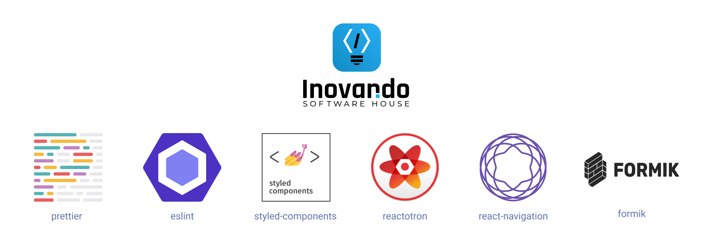

# react-native-template-inovando
> 📱 Inovando's template for react-native-cli

[](https://www.npmjs.com/package/react-native-template-inovando)
[](https://github.com/prettier/prettier)



## Preview

|   iOS   |  Android  |
|---------|-----------|
|  |  |

## Usage
1. Initialize your RN project with this command:

```bash
react-native init AwesomeProject --template inovando
```

2. Delete `~/App.js`

3. Duplicate `.env.example` to `.env` and `.env.production` fulfilling variables as needed

4. Add these lines at `.gitignore`

```bash
# Environment
.env
.env.production
```

4. Done 🎉

## Android

For Reactotron debug in Android, run this command:
```
adb reverse tcp:9090 tcp:9090
```

### MacOS "Network Error"

1. Go to "Open Network Preferences" > "Advanced..." > "DNS" Tab and add 8.8.8.8.


2. Restart your AVD.


3. It should work fine! 🎉

## Scripts

### `yarn react-devtools`

Inspect elements with [React Devtools](https://www.npmjs.com/package/react-devtools). Open the in-app developer menu and choose "Toggle Inspector" then click/press any element in your App, it will show up in React Devtools Window.

[Read More](https://facebook.github.io/react-native/docs/debugging#react-developer-tools)


## Deploy

This command will also deploy to Yarn.
```
npm publish --access public
```

## Features
- [x] [Module Resolver](https://github.com/tleunen/babel-plugin-module-resolver)
- [x] [ESLint](https://github.com/santospatrick/eslint-config-react)/[Prettier](https://github.com/santospatrick/prettier-config)
- [x] [Styled Components](https://styled-components.com/docs/basics#react-native)
- [x] [Dotenv](https://github.com/zetachang/react-native-dotenv)
- [x] [Axios](https://www.npmjs.com/package/axios)
- [x] [React Navigation](https://reactnavigation.org/en/)
- [x] [Reactotron](https://github.com/infinitered/reactotron)
- [x] [React Devtools](https://www.npmjs.com/package/react-devtools)
- [x] [Formik](https://jaredpalmer.com/formik/)
- [x] [Yup](https://github.com/jquense/yup)
